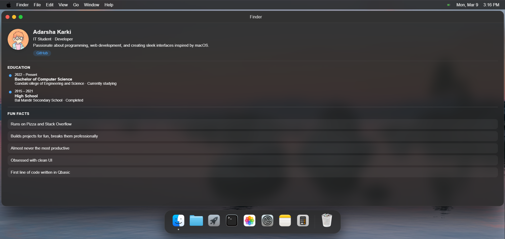
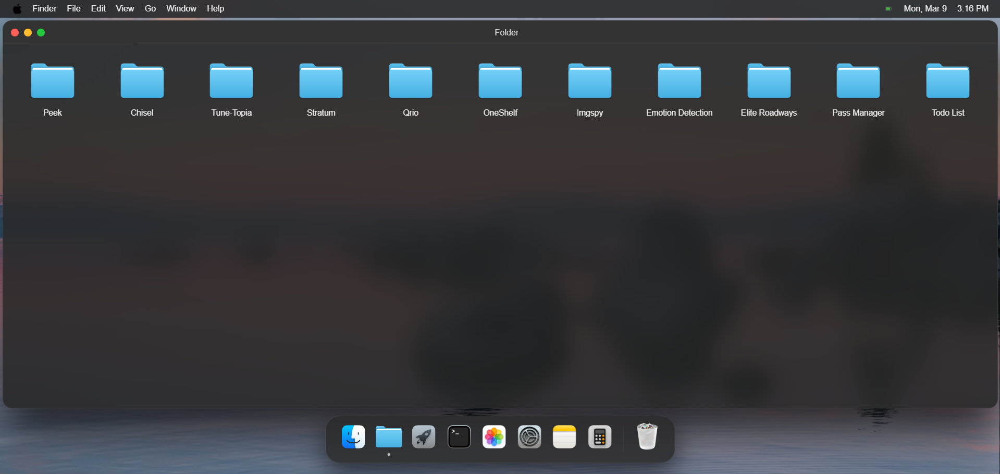
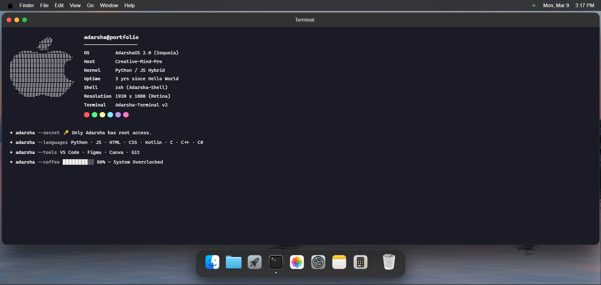
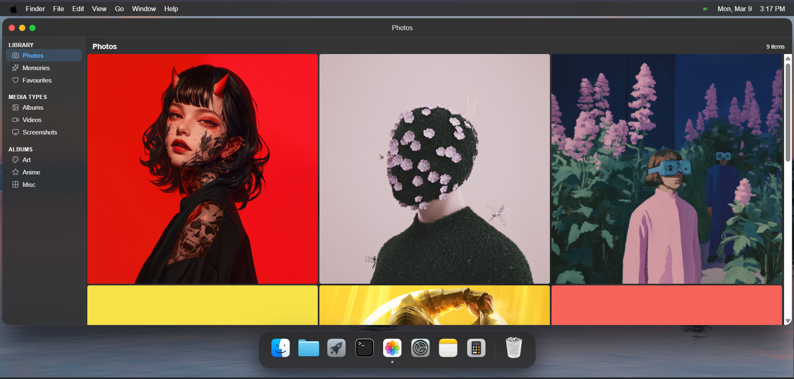
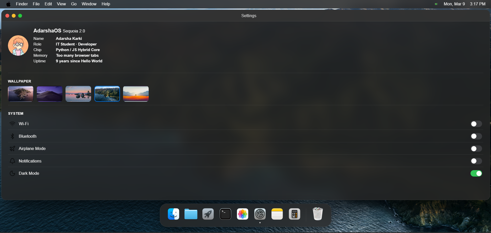
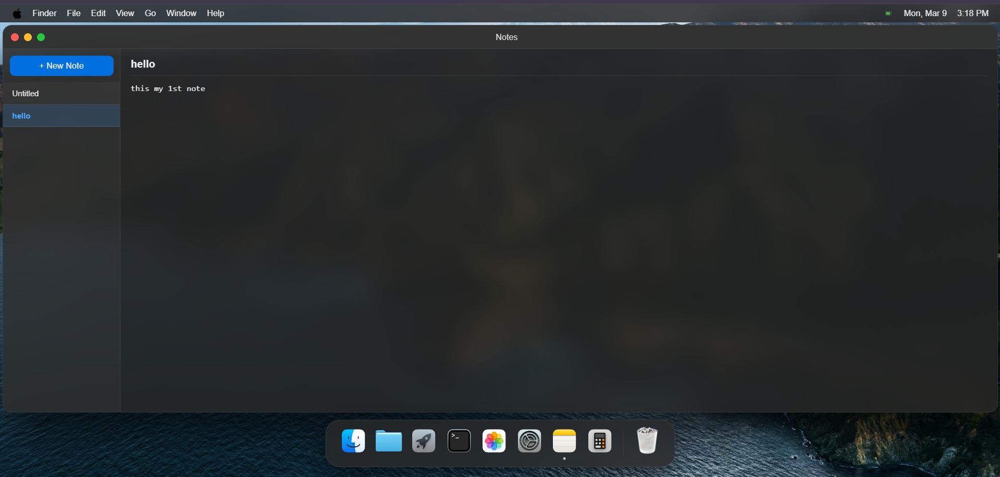
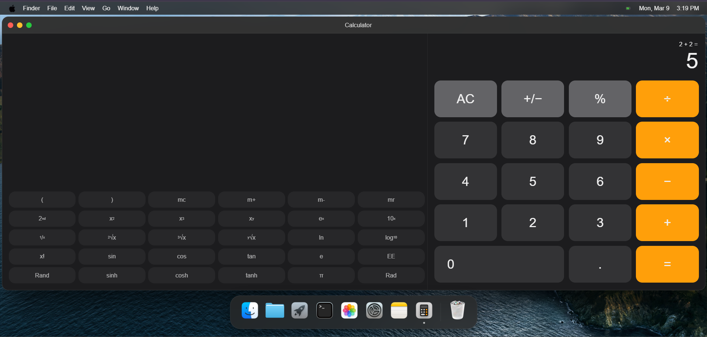
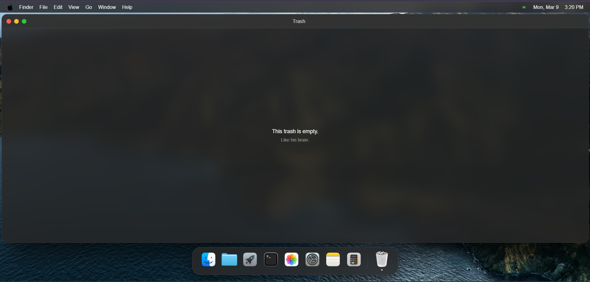

# Adarsha Karki – macOS-Style Personal Website

A macOS-inspired interactive personal website built with HTML, CSS, and JavaScript. The site mimics the macOS desktop interface — including a dock, draggable multi-window system, app-like popups, dark mode, spotlight search, boot screen, and custom cursors — while showcasing my portfolio, projects, and personal information.

Inspired by [Samidy](https://samidy.com/)

---

## Features

### Desktop & System
- Fully interactive desktop with macOS-style menu bar and dock
- Boot screen with Apple logo, progress bar, and startup chime on first load
- Dynamic live clock with AM/PM format
- Wallpaper switcher — select from multiple wallpapers, persists across sessions via localStorage
- Dark mode toggle that affects the entire UI
- Click ripple effect on every mouse click
- Custom cursors for pointer, text, drag, and default actions
- Spotlight search (Cmd+Space) — type any app name to open it instantly
- Escape key closes the focused window
- Running indicator dots under open apps in the dock
- Dock tooltips on hover with smooth fade animation
- Neighbour magnification on dock icons
- Window drag clamped to never overlap the menu bar or dock
- Multi-window support - open multiple apps simultaneously, click to focus

### Easter Eggs
- **Konami code** (↑↑↓↓←→←→BA) — secret modal appears
- **Kernel panic** — click the Apple logo in the menu bar

---

## Apps

### Homepage

### 1. Finder (About Me)
Personal info in a macOS Finder style with three sections — profile with social links, education timeline, and fun facts.

### 2. Folder (Projects)
GitHub projects displayed as macOS folder icons. Click any folder to open the repository in a new tab.

Projects: Crop Compass · Emotion Detection · Elite Roadways · Pass Manager · TodoList

### 3. Launchpad (Games)
Full-screen grid of deployed games. Click to open live demo.

Games: Impossible Tic Tac Toe · Tic Tac Toe · Tetris · Flappy Bird · Classic Snake

### 4. Terminal (Tech Stack)
Neofetch-style terminal with Apple braille ASCII art, system info panel, and colour-coded command output.

### 5. Photos (Gallery)
Apple Photos-style layout with sidebar (Library, Media Types, Albums), filterable grid, and fullscreen lightbox on click.

### 6. Settings
macOS Settings-style window with three sections:
- **About This Mac** — name, role, specs, copy email button
- **Wallpaper picker** — thumbnail grid, click to change desktop wallpaper live
- **System toggles** — Wi-Fi, Bluetooth, Airplane Mode, Notifications, Dark Mode (functional)

### 7. Notes
Fully working notepad with sidebar note list, multi-note support, auto-save to localStorage. Notes persist across page refreshes.

### 8. Calculator
Standard mode (circular buttons) and scientific mode (pill buttons, fullscreen only). Keyboard support included.

### 9. Trash
It's empty. Like his brain.

---

## Visit my [Portfolio](http://adarshakarki.com.np/)